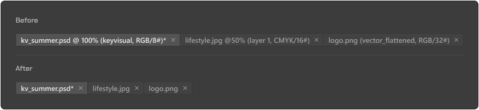

# PS Tabs Cleaner

Make Adobe Photoshop document tabs show **only the file name** — no more
`file.psd @ 33,3% (Layer 0, RGB/8#)` clutter.



## Why
Photoshop appends zoom level, active layer and color mode to every document
tab and there is no preference to turn it off ([requested since 2022](https://community.adobe.com/feature-requests-713/photoshop-request-edit-information-shown-in-the-open-file-tabs-653953)).
With long file names your tabs become unreadable.

## How it works
Photoshop builds tab titles from text templates stored in its localization
dictionary (`tw10428_*.dat`). PS Tabs Cleaner rewrites the four
`$$$/ImageWindow/TitleTemplate*` entries to the file-name token (`^0`).
No application code is touched, and a `.bak` backup of every file is kept.

## Usage (Windows)
1. Download `PhotoshopTabFix.exe` from [Releases](../../releases).
2. Close Photoshop, run the exe (admin prompt), click **Fix tabs**.
3. Start Photoshop.

**Restore original tabs** any time with the second button.
A Photoshop update reverts the templates — just run Fix again.
Works with every installed Photoshop version and UI language.

## macOS
Run `PhotoshopTabFix-mac.sh` with sudo (signed .app coming later):
```
sudo ./PhotoshopTabFix-mac.sh            # fix
sudo ./PhotoshopTabFix-mac.sh --restore  # undo
```

## Building from source
```
csc /target:winexe /out:PhotoshopTabFix.exe /win32manifest:app.manifest ^
    /r:System.Windows.Forms.dll /r:System.Drawing.dll PhotoshopTabFix.cs
```
(.NET Framework's csc ships with Windows.)

## Disclaimer
Use at your own risk. This modifies files inside your Photoshop installation,
which may not be covered by Adobe's EULA. Not affiliated with Adobe.

---
Part of the **A.D.I. — Asset Delivery Interface** ecosystem ([adi.online](https://www.adi.online)),
developed by [DUDKIEWICZ CORP](https://www.dudkiewiczcorp.com), founded by Adrian Dudkiewicz.
